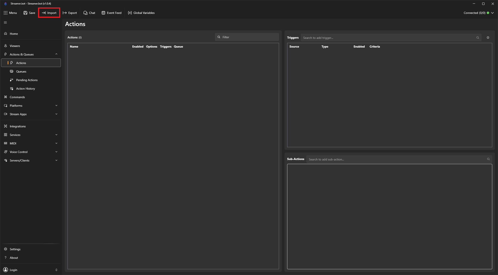
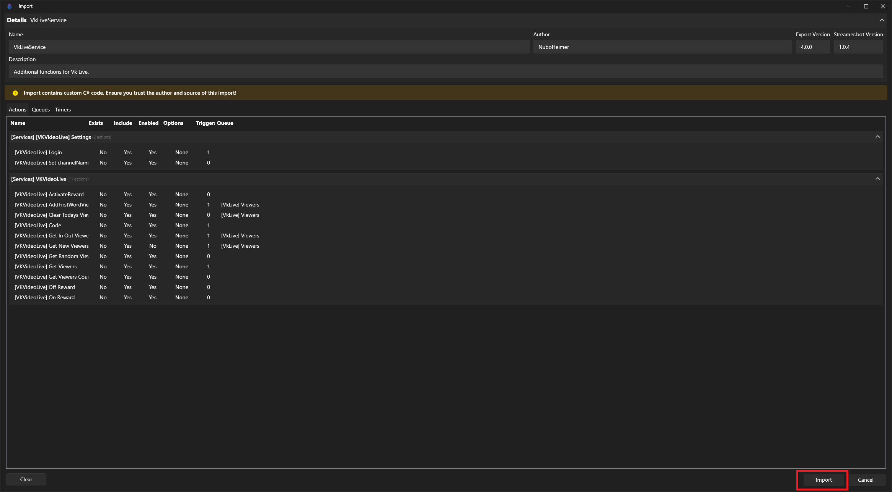
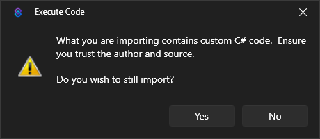

# VkLiveService - Руководство по установке и обновлению.

## Зависимости (обязательно для событий в MiniChat)
Если вы используете события, которые должны **отображаться в MiniChat**, у вас должна быть установлена/подключена интеграция **MiniChat** для Streamer.bot.

В коде сервиса события отправляются через вызов метода:
- коллекция методов: `MiniChat Method Collection`
- метод: `CreateCustomEvent`

Если этой коллекции/метода нет (интеграция MiniChat не установлена или не импортирована), то экшены сервиса будут выполняться, но **события в MiniChat отображаться не будут**.

## Установка.
1. Скачайте файл `VkLiveSerive.txt` из последнего [релиза](https://github.com/NuboHeimer-for-streamers/-Streamer.Bot-VkVideoLiveService/releases).
2. Запустите стримербот.
3. В верхнем меню нажмите кнопку `Import`.

  

4. Перетащите скачанный ранее `VkLiveService.txt` в область `Import String`. Если перетащить не получается, откройте файл блокнотом, скопируйте текст и вставьте его в `Import String`.
5. Нажмите кнопку Import справа внизу.

  

5.1. Начиная с версии 1.0.0 Streamer.bot предупреждает, что вы импортируете кастомный C# код. Соглашаемся.

  

6. Установка завершена.

## Обновление с версии 1.0.3.
1. Запустите экшен **\[Twitch] Remove twitch_todays_viewers**

  

2. Запустите экшен **\[Twitch] Remove twitchLastViewersNameList**

  

Это нужно для удаления старых глобальных переменных, которые больше не используются.