## Disclaimer

Предполагается, что у вас уже есть установленная и настроенная интеграция с миничатом.

## Создание приложения вк.
Для работы этого модуля вам необходимо создать в вк своё приложение.
1. Переходим по ссылке https://dev.live.vkvideo.ru/apps и нажимаем "Войти" справа вверху.

  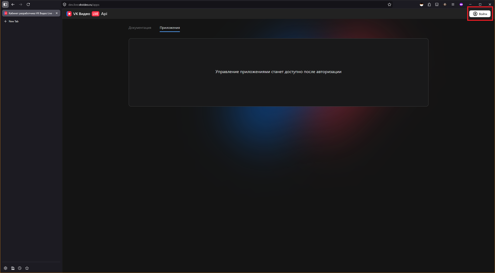

2. Нажимаем "Создать приложение":

  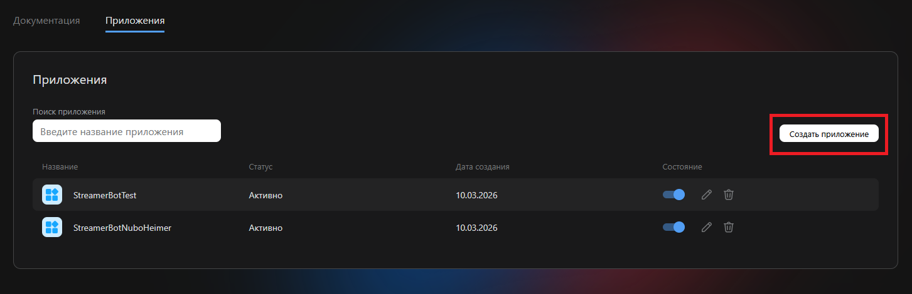

- Называем приложение как нам хочется.
- Описание пишем так же какое угодно.
- При желании загружаем иконку.
- URL для web-push оставляем пустым.
- В последнее поле вставляем `http://localhost:5000/vkvideoliveredirecturi`
- Нажимаем "Создать"  

  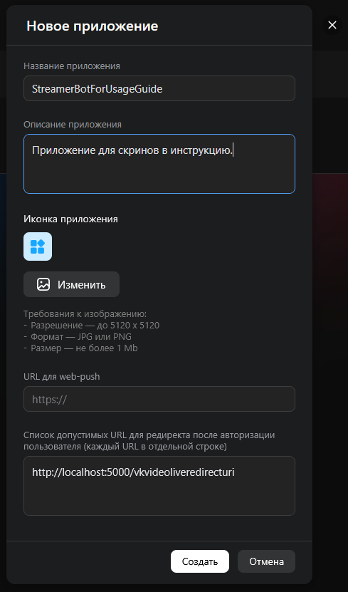

3. Записываем id приложения, секретный и публичный ключи. Они нам ещё пригодятся.
4. Нажимаем "Хорошо".

## Настройка модуля и стримербота.
1. Находим экшен `[VKVideoLive] Set channelName`
2. В set argument в sub-actions вписываем название своего канала так, как оно отображается в адресной строке браузера.  

  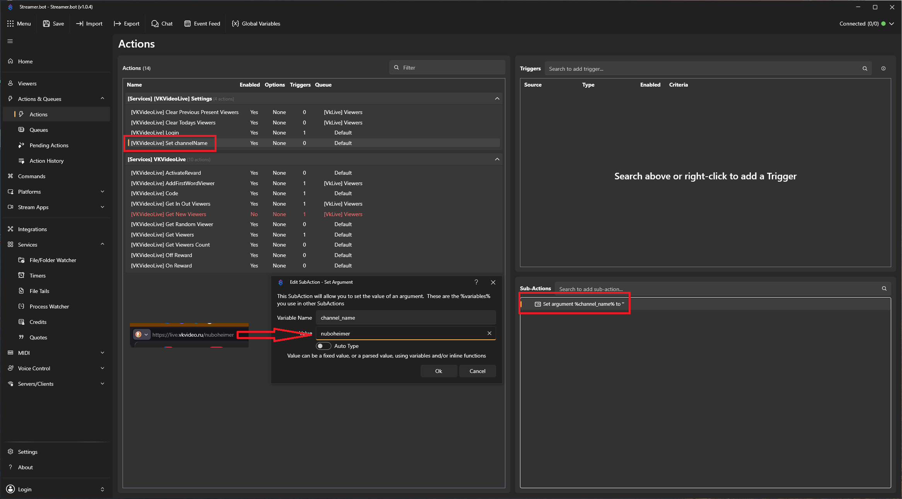

3. Находим экшен `[VKVideoLive] Login`
4. В sub-actions заполняем ранее сохранённые значения:
- VkLiveAuthClientId -> ID приложения
- VkLiveAuthClientSecret -> Секретный ключ приложения
- VkLiveAuthRedirectUri -> URL для редиректа

  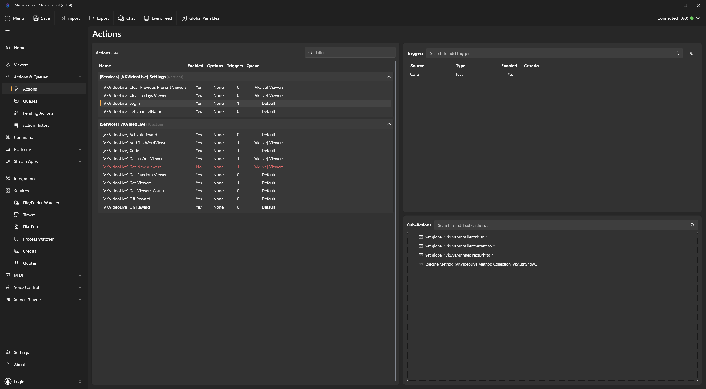

5. Запускаем тестовый триггер.  

  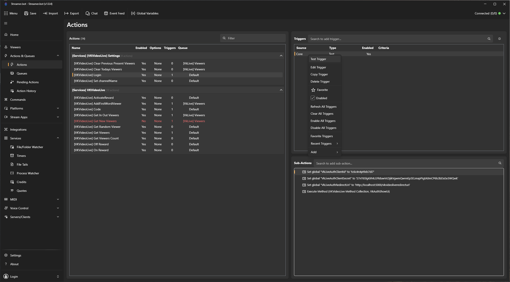

6. В открывшемся окне нажимаем `Login`.  

  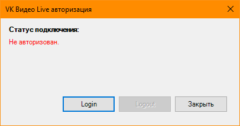

7. Вас перебросит в браузер по умолчанию и попросит подтвердить разрешения приложения.
- нажимаем "разрешить".
- видим в браузере сообщение об успешной авторизации.
- окно логина можно закрывать. В нём так же будет отображаться успешное подключение.

  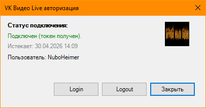

## Работа с экшенами.

### Общие рекомендации по триггерам

>⚠ Важно
>
> Для корректной очистки списков и избежания ошибок в определении зрителей, используйте триггер: **OBS -> Streaming Started** или привязанную к запуску стрима горячую клавишу.

### \[VKVideoLive] Clear Previous Present Viewers.

Экшен очищает сохранённый список **Present Viewers**, чтобы исключить устаревшие данные перед началом трансляции.  

  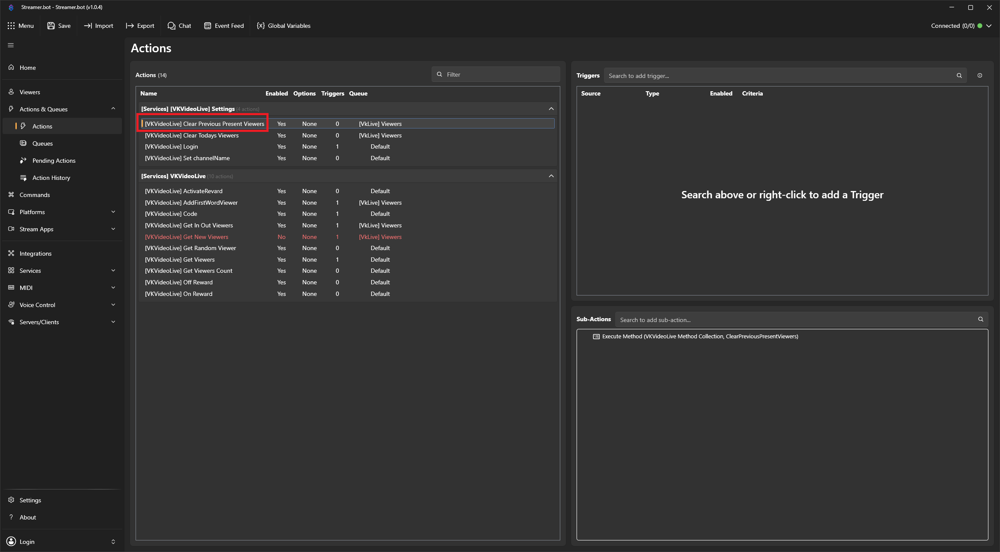

- Очищайте список перед запуском стрима, иначе в нём могут храниться устаревшие данные и зрители будут определяться неверно. Рекомендации по триггеру на очистку смотрите в блоке "Важно" выше.

### \[VKVideoLive] Clear Todays Viewers.

Экшен очищает сохранённый список «сегодняшних» зрителей для корректного определения новых зрителей текущей трансляции.  

  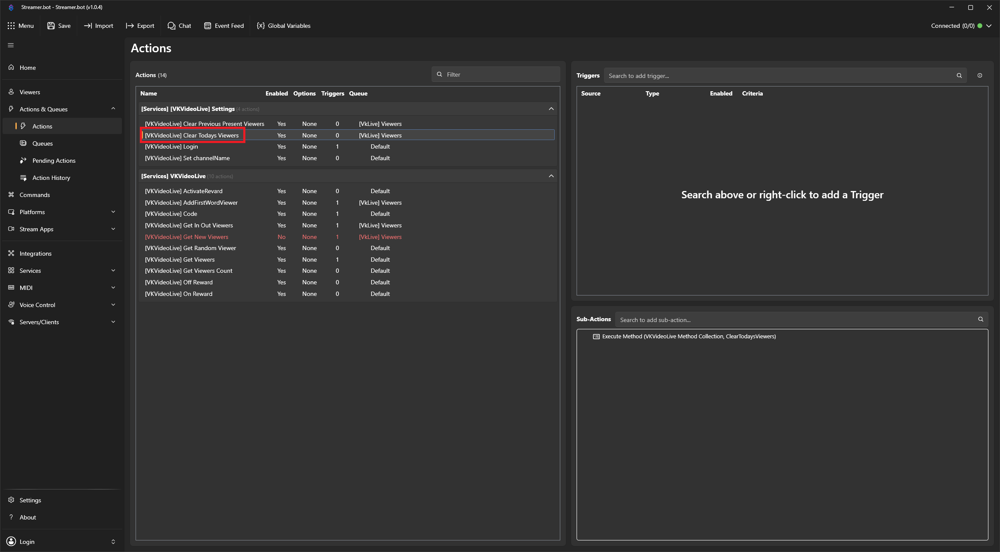

- Очищайте список перед запуском стрима, иначе в нём могут храниться устаревшие данные и зрители будут определяться неверно. Рекомендации по триггеру на очистку смотрите в блоке "Важно" выше.

### \[VKVideoLive] ActivateReward.

Экшен позволяет активировать любую награду канала от вашего имени.  

  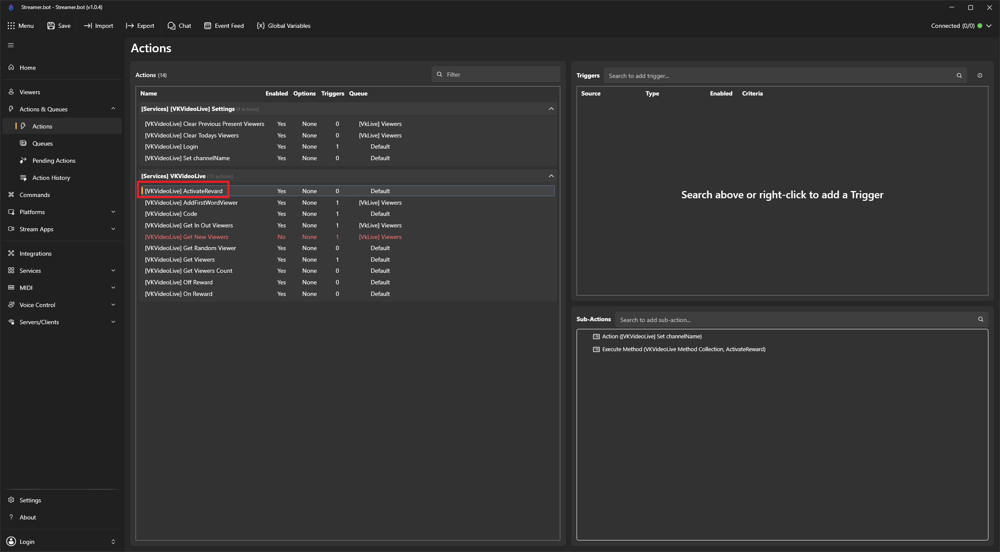

Для работы экшена необходимо создать новый экшен, в нём задать аргументы:
- rewardName -- название награды как оно отображается для зрителя на сайте.
- rewardText -- текст награды, если она требует ввод текста.
После чего вызвать сам экшен `[VKVideoLive] ActivateReward` через Run Action. Пример:

  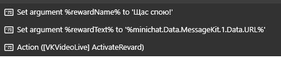

### \[VKVideoLive] AddFirstWordViewer

Экшен добавляет зрителя, написавшего в чат впервые за сегодняшнюю трансляцию, в список «впервые зашедших» зрителей. Это позволяет не отправлять событие в MiniChat для уже увиденных в чате зрителей.  

  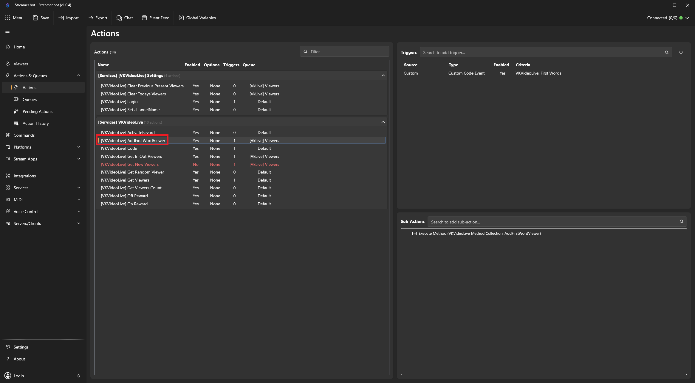

- Триггер: **Custom -> MiniChat -> -> VkVideoLive -> First Words**
- Используйте, если не хотите видеть событие в MiniChat для зрителей, написавших сообщение в чат. Если событие нужно — отключите этот экшен.

### \[VKVideoLive] Code

Служебный экшен с кодом. Так же в нём можно узнать текущую версию (указана в комментарии в сабэкшенах и в самом коде).  

  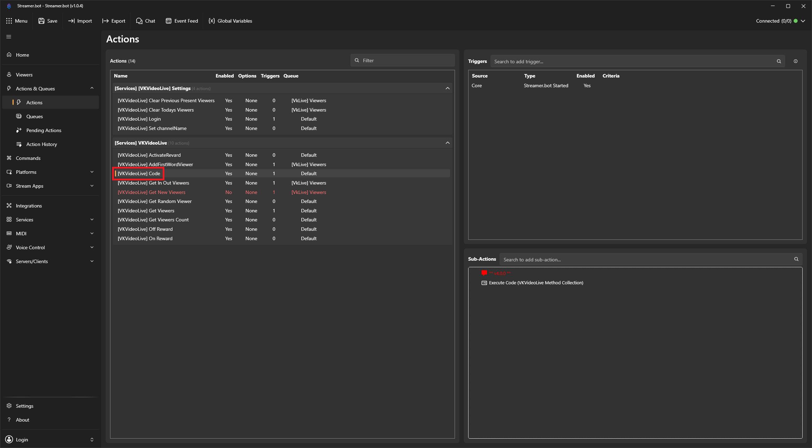

### \[VKVideoLive] Get In Out Viewers

Экшен отправляет в MiniChat пользовательское событие о пришедшем или ушедшем зрителе.

  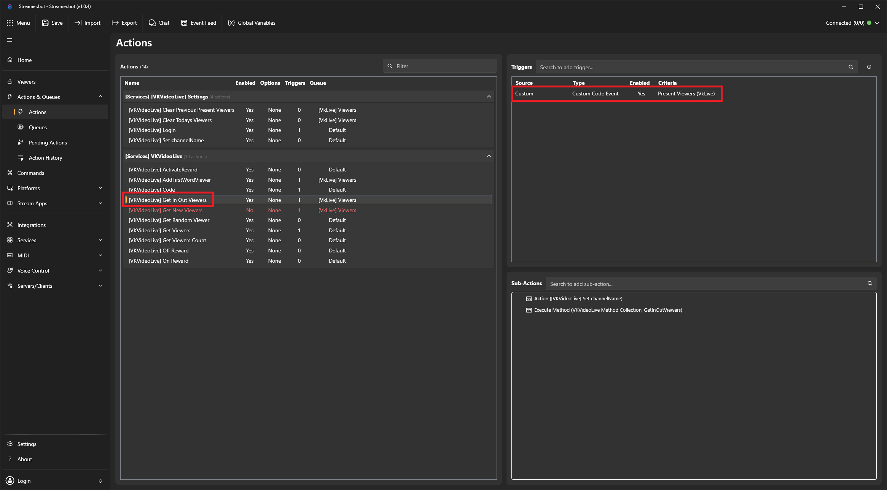

- Триггер: **Custom -> Vk Video Live -> Present Viewers (VkLive)**.
- Пишет, когда зритель впервые зашёл на трансляцию.
- Пишет, когда зритель просто появился в списке зрителей (пришёл на трансляцию).
- Пишет, когда зритель пропал из списка зрителей (ушёл с трансляции).
- Примечания: требует корректной настройки экшена **[VKVideoLive] Get Viewers** и предварительной очистки списков перед началом трансляции.

### \[VKVideoLive] Get New Viewers

Экшен отправляет в MiniChat пользовательское событие о новом зрителе на текущей трансляции. По умолчанию выключен. Если используете Get In Out Viewers, то оставьте выключенным.

  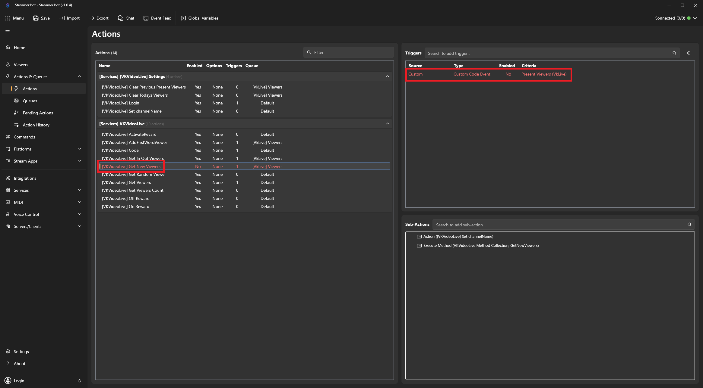

- Триггер: **Custom -> Vk Video Live -> Present Viewers (VkLive)**.
- Примечания: требует корректной настройки экшена **[VKVideoLive] Get Viewers** и предварительной очистки списков перед началом трансляции.

### \[VKVideoLive] Get Random Viewer

Экшен получает одного случайного зрителя и записывает его имя в аргумент `randomUserName0`.

  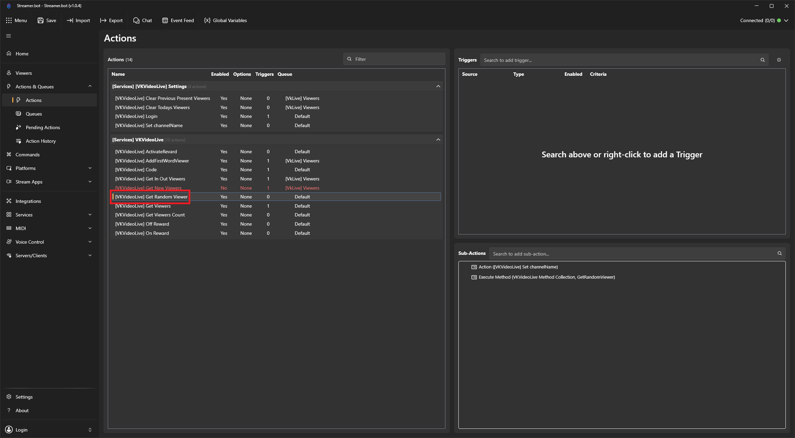

### \[VKVideoLive] Get Viewers

Экшен получает список зрителей аналогично тому, как это делает родной PresentViewers. Список вк ограничен количеством в 200 зрителей.

  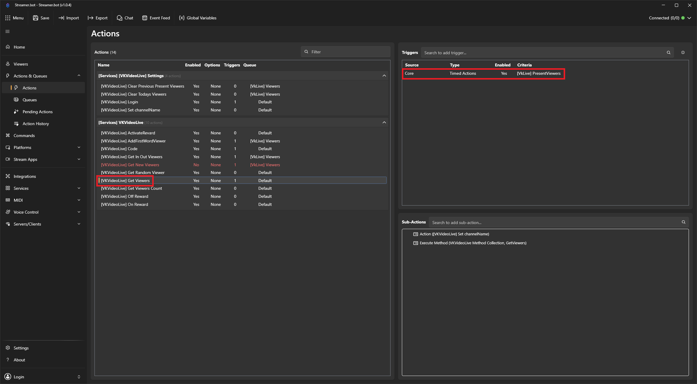

- Триггер: Timed Action `[VkLive] PresentViewers`. По умолчанию таймер отключен. Рекомендуется настроить его включение при старте стрима и отключение при окончании, чтобы список зрителей не получался, когда стрим оффлайн. Ставить интервал таймера меньше минуты СТРОГО НЕ РЕКОМЕНДУЕТСЯ.
- Список зрителей записывается в аргумент `users`, как это делает родной PresentViewers.
- В аргумент `viewers_count` записывается размер полученного списка (не больше 200). Чтобы получить **полное** число зрителей на канале, используйте экшен **Get Viewers Count** (см. ниже).

### \[VKVideoLive] Get Viewers Count

Запрашивает у API **полное** число зрителей на канале (не ограничено лимитом списка в 200) и записывает его в аргумент `viewers_count`.

- Аргумент: `channel_name` — URL канала, как для остальных экшенов.
- Имеет смысл вызывать, когда нужна именно общая цифра на трансляции; для списка ников по-прежнему используйте **Get Viewers**.

  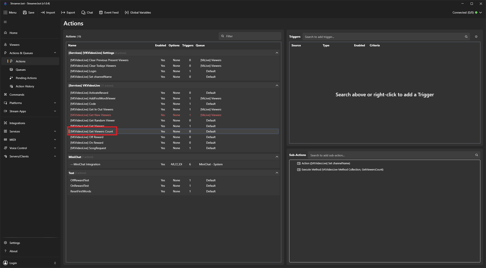

### \[VKVideoLive] Off Reward

Экшен позволяет отключить любую награду канала.  

  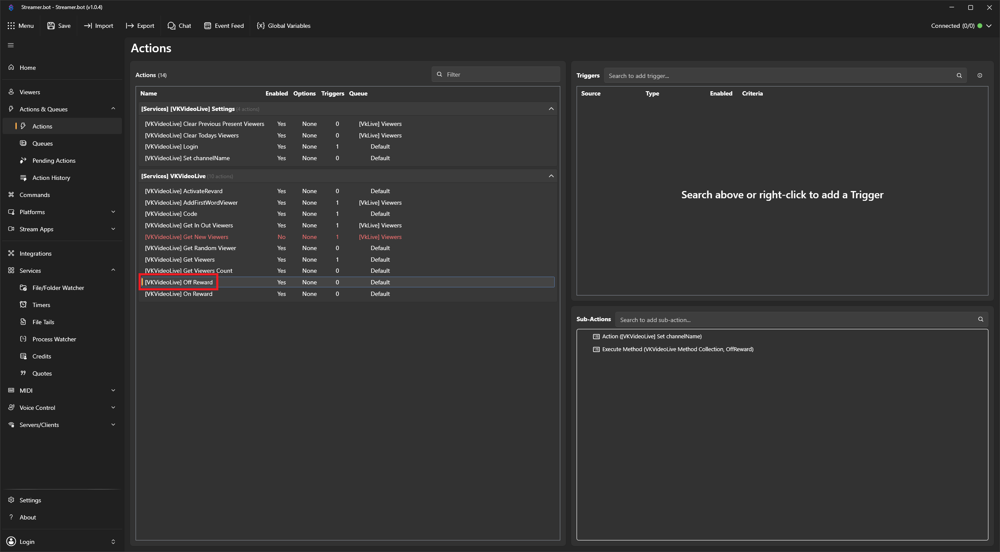

Для работы экшена необходимо создать новый экшен, в нём задать аргумент:
- `rewardName` -- название награды как оно отображается для зрителя на сайте.
После чего вызвать сам экшен `[VKVideoLive] Off Reward` через Run Action. Пример:

  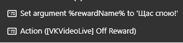

### \[VKVideoLive] On Reward

Экшен позволяет включить любую награду канала.  

  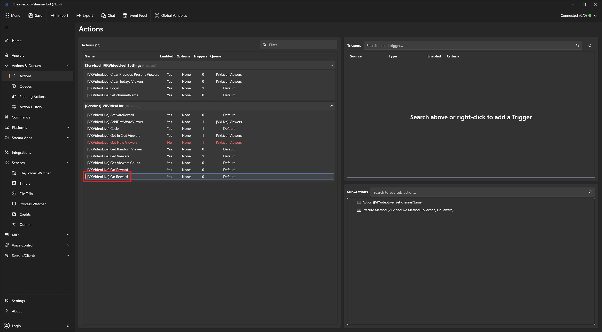

Для работы экшена необходимо создать новый экшен, в нём задать аргумент:
- `rewardName` -- название награды как оно отображается для зрителя на сайте.
После чего вызвать сам экшен `[VKVideoLive] On Reward` через Run Action. Пример:

  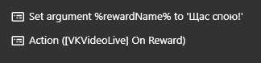

